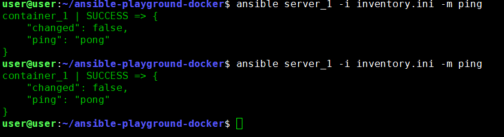
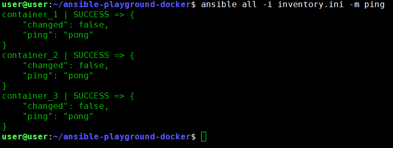
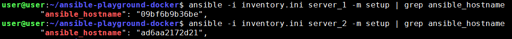
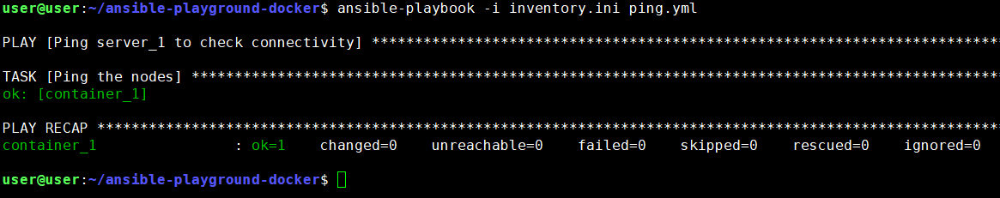
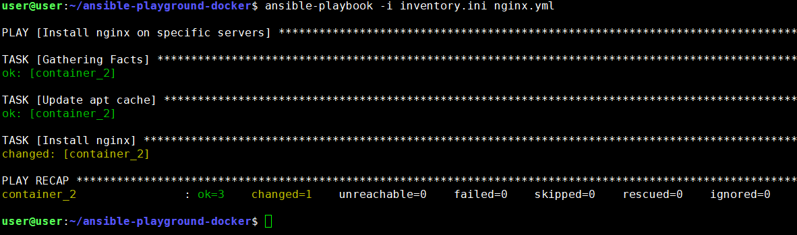
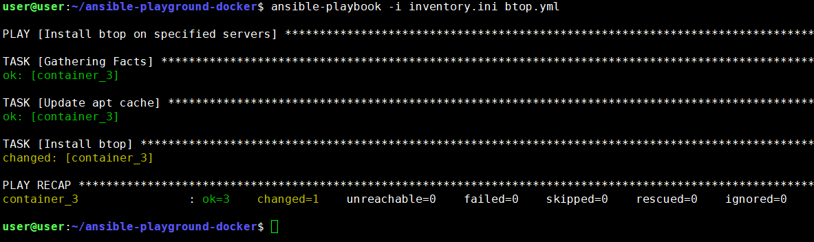

# Ansible Playground Docker (Support 100+ Nodes)
This repository provides a comprehensive guide to deploying **Ansible Playground Docker** using Docker. The setup includes demonstrations and step-by-step instructions, making it easy for beginners to quickly spin up an Ansible environment.
## Purpose

The primary goal is to enable users to quickly create an Ansible playground in seconds. This setup is particularly beneficial for beginners who may not have access to multiple systems or servers, allowing them to practice and explore Ansible effortlessly.

## Table of Contents

- [Prerequisites](#prerequisites)
- [Features](#Features)
- [Quick Start](#quick-start)
	- [Clone Repo](#Clone-Repo)
	- [Set No of Ansible Server](#Set-No-of-Ansible-Server)
	- [Setup Ansible Lab](#Setup-Ansible-Lab)
- [Lab Test](#Lab-Test)
- [Clean LAB](#Clean-LAB)
- [Conclusion](#Conclusion)
## Prerequisites
- Docker and Ansible must be installed on your system.
- Basic understanding of Docker and Ansible.
- Basic knowledge of command-line operations.
## Quick Start
### Features
- Spin up 100+ lab based on your hardware specification.
- Run Ansible Playground Docker within Seconds.
- Dynamic variable support, no static Username and password.
- Easy to setup LAB in seconds.
- Destroy lab in seconds, once you needed.
### Clone Repo

```
git clone https://github.com/meibraransari/ansible-playground-docker.git
```

```
cd ansible-playground-docker
```
### Set no of Ansible Server

To Set No of Ansible Server change below variable or go with the defaults.
```
nano setup_playground.sh
```

```
# Set no of Servers
containers=3
```

### Setup Ansible Lab
```sh
bash setup_playground.sh
```

The script should perform the following tasks:
- **Generate SSH Key:** Create an SSH key pair named ansible_id_rsa_key in the home directory of the current user.
- **Start Containers:** Launch containers based on a specified variable named containers.
- **Test Connectivity:** Verify the network connectivity of the created containers.
- **Generate Inventory File:** Create an inventory file in the user's home directory that lists the containers.
- **Create Ansible Configuration File:** Generate an Ansible configuration file in the home directory of the current user.
- **Ping Created Servers:** Execute a ping command to check the reachability of the newly created containers.
### Lab Test

### Test 1: Ping one by one server
```
ansible server_1 -i inventory.ini -m ping
```

```
ansible server_2 -i inventory.ini -m ping
```

### Test 2: Ping all Servers at once
```
ansible all -i inventory.ini -m ping
```

### Test 3: Check hostname of Servers

```
ansible -i inventory.ini server_1 -m setup | grep ansible_hostname
```
```
ansible -i inventory.ini server_2 -m setup | grep ansible_hostname
```

### Test 4: List Docker containers (LAB- Server)
```
docker ps -a
```

### Test 5: Ping Server 1 using Playbook
```
ansible-playbook -i inventory.ini ping.yml
```


### Test 6: Install Nginx on server_2 using Playbook
```
ansible-playbook -i inventory.ini nginx.yml
```


Verify installed apps
```
docker exec -it server_2 /bin/bash
nginx -v
netstat -tlpn
nginx 
netstat -tlpn
curl localhost
exit
```

### Test 7: Install btop on server_3 using Playbook
```
ansible-playbook -i inventory.ini btop.yml
```

```
docker exec -it server_3 /bin/bash
btop --version
btop --utf-force
exit
```

### Clean LAB
Below command only delete created by this lab script.

```
docker rm -f $(docker ps -aq --filter "name=^server_[0-9]+$")
```
I hope you enjoyed using this Ansible lab! 😊
### Conclusion
In summary, the Ansible Playground Docker offers a streamlined and efficient way for beginners to explore and practice Ansible without the need for multiple systems or servers. By providing an accessible and quick setup, this lab empowers users to enhance their skills and confidence in automation, paving the way for deeper exploration of Ansible's capabilities. We hope you found this resource helpful and enjoyable!

---
## Thank you for the Support 😊
- ⭐ Give this repo a ⭐ star ⭐ at the top of the page
### 💼 Connect with me 👇

- 🔥 [**Youtube**](https://www.youtube.com/@DevOpsinAction?sub_confirmation=1)
- ✍ [**Blog**](https://ibraransari.blogspot.com/)
- 💼 [**LinkedIn**](https://www.linkedin.com/in/ansariibrar/)
- 👨‍💻 [**Github**](https://github.com/meibraransari?tab=repositories)
- 💬 [**Telegram**](https://t.me/DevOpsinActionTelegram)
- 🐳 [**Docker**](https://hub.docker.com/u/ibraransaridocker)